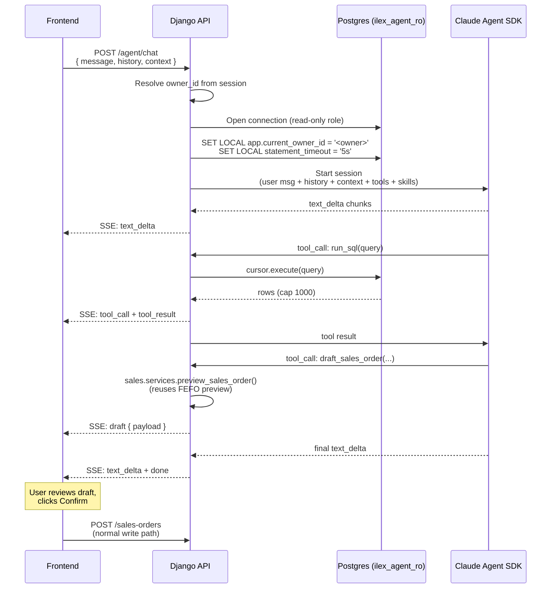

# Ask Ilex — the agent that explains your inventory

> **Status:** ⏸ Deferred — Phase 3, not implemented in v1. The schema commitments that make this buildable (read-only role substrate, owner-projecting `v_*` views, append-only ledger, immutable allocations) all shipped in v1. To activate, see [`docs/issues/012`](issues/012-setup-agent-foundation-and-readonly-role.md) → [`015`](issues/015-add-onboarding-skill-and-empty-state-integration.md).

Ask Ilex is an in-product chat agent for F&B brand owners. It reads your stock ledger, drafts sales orders, and — most importantly — **explains causal stories no dashboard can show you**: why margin moved, what the recall actually traced, where stock disappeared this week.

It is the narrative differentiator. Several of the system's foundational decisions — the append-only `stock_movements` ledger (D1), immutable `sale_allocations` so cost layers stay reconstructable (D8), allowlisted read-only views, owner-isolated by composite FK (D4) — exist partly to make the agent's **Explain mode** trustworthy.

This document explains how it works at runtime. For the implementation spec, see [`specs/agent.md`](specs/agent.md). The agent is **Phase 3** — it is not part of the v1 MVP, but its schema commitments (read-only Postgres role, view rewrites for owner filtering) ship from day one so the agent can be turned on later without migrating data.

---

## The three modes

A single endpoint, three behavioral modes that emerge from how the LLM uses its tools.

**Query** — read-only, autonomous.
> *"What's expiring next week?"*
> The agent runs one SQL query against `v_expiring_batches`, renders the result inline.

**Draft** — write with approval, never direct.
> *"Create a sales order for Acme Café — 20 cans of Cold Brew."*
> The agent looks up the product, checks FEFO feasibility, returns a **proposed JSON payload**. The frontend shows the standard SO draft UI; the user reviews and clicks Confirm. The confirm hits the normal `POST /sales-orders` endpoint. The agent never wrote anything.

**Explain** — read-only, multi-query.
> *"Why did Cold Brew margin drop 8% this month?"*
> The agent walks the cost layers (FIFO allocations from `sale_allocations` × `batches.unit_cost`), compares this month's `v_margin_by_product` to last month's, finds the movements that shifted the layer mix, and tells you the story. No dashboard provides this; it is structurally a multi-step reasoning task on a ledger.

The same chat endpoint serves all three. The mode is the LLM's behavior, not a server flag.

---

## End-to-end runtime



### What happens at each step

1. **Frontend posts the message** plus its current view state (`route`, `filters`, `selected_ids`) and the FE-held conversation history. The server is stateless — it stores no chat sessions.
2. **Server opens a read-only Postgres connection** as `ilex_agent_ro` and sets two `LOCAL` session variables: the current owner's UUID, and a 5-second statement timeout.
3. **Server starts a Claude Agent SDK session.** The SDK auto-loads skill files from `apps/agent/skills/` (markdown describing the schema, cost layers, FEFO, recall, onboarding). Tools are registered as Python callables.
4. **The LLM streams.** Token deltas relay to the frontend over SSE in real time.
5. **The LLM calls tools.** Two tools exist:
   - `run_sql(query)` — executes the query against the open connection, returns up to 1000 rows.
   - `draft_sales_order(...)` — calls the existing `sales.services.preview_sales_order` to validate FEFO, returns a proposed payload. Other draft tools (`draft_recall`, `draft_purchase_order`) follow the same pattern and are added on demand.
6. **Tool results flow back** to the LLM and out to the frontend (so the UI can show what was queried).
7. **On `done`**, the read-only transaction commits (no writes occurred), the SDK session closes, the SSE stream ends.
8. **For drafts**, the frontend opens the standard draft UI with the agent's payload pre-filled. User confirms → normal write API. Agent never had write access.

---

## The safety model

The LLM is untrusted. The database is the perimeter.

| If the LLM tries to… | What stops it | Layer |
|---|---|---|
| Read another owner's data | Each `v_*` view embeds `WHERE owner_id = current_setting('app.current_owner_id')::uuid`. The other rows are invisible at the view level | View DDL |
| Read base tables (e.g. `batches`, `stock_movements`) | `REVOKE ALL ON ALL TABLES IN SCHEMA public FROM ilex_agent_ro`; only `v_*` views granted | Postgres role |
| Write anything | Read-only role. `INSERT`/`UPDATE`/`DELETE`/`DDL` all return permission denied | Postgres role |
| Run a slow or runaway query | `SET LOCAL statement_timeout = '5s'`. Postgres kills it | Postgres session |
| Mass-exfiltrate via huge result sets | Tool wrapper fetches at most 1001 rows, truncates at 1000, sets `truncated: true` flag | Python tool |
| Bypass owner scope when drafting an SO | Draft tools call existing services that go through the same `@scoped` decorator and composite FK checks (D4) as human-facing endpoints | Service layer |
| Write malformed SQL | Postgres errors; SDK surfaces the error to the LLM as a tool result; the LLM retries with corrected SQL | Tool loop |

There is no Python-side SQL parsing or validation. The role + view + timeout do all the work. This is the elegance of the SQL agent pattern: **the LLM's expressiveness is bounded by what the database role can do**, and that's a much smaller and better-tested surface than hand-rolled query DSLs.

### Why view-level filtering instead of row-level security

Postgres RLS works at the table level. The agent role has no table access — only views. So we push the filter into each view's `WHERE` clause and use a session GUC (`app.current_owner_id`) for the value. Setting a GUC is one statement at request start; it implicitly scopes every view query for the rest of the transaction.

The human-facing API doesn't need this — it passes `owner_id` as a parameter through the `@scoped` query decorator, the same way it always has. The view rewrites are agent-specific; the human path is unchanged.

---

## Why this design

**One tool for reads, not five.** Each `v_*` view is a self-describing entity (with the schema skill file documenting columns and meaning). The LLM writes SQL; Postgres enforces. Per-view typed tools would add boilerplate, restrict expressiveness (no joins, no CTEs, no window functions), and provide no safety not already provided by the role + view + timeout.

**Drafts return JSON instead of writing rows.** The agent has no special "draft" code path on the server — it returns a payload that the frontend submits via the normal API on confirm. This means the agent's writes are always reviewed by a human, always go through the same validation as any other write, and add **zero new tables** (no `agent_drafts`, no `agent_chats`, no `agent_messages`).

**Stateless server.** Conversation history lives in the frontend. If the user refreshes the page, history is gone — that's fine for v1. Adding server-side persistence is a `agent_messages` table away when needed.

**Skills as markdown.** The Claude Agent SDK loads `apps/agent/skills/*.md` natively. No classifier, no embeddings, no vector store. Adding domain knowledge means writing a markdown file. The same shape as the [Anthropic Agent Skills](https://www.anthropic.com/news/agent-skills) format.

**SSE, not polling, not chunked JSON.** Streaming tokens is what makes Explain mode feel native — a 10-second narrative answer arrives word-by-word, not as a 10-second spinner. DRF's `StreamingHttpResponse` plus `text/event-stream` is ~30 lines of code.

**Single shared OAuth token.** The server holds one `CLAUDE_CODE_OAUTH_TOKEN` (the Claude Max subscription). For the take-home, this means no per-user OAuth flow to build. For multi-tenant production, it's a straightforward extension to per-user tokens with per-user budgets — but that's not v1's problem.

---

## What is not built in v1

These are deliberate omissions, not oversights:

- **No per-user OAuth.** One shared subscription. Adding per-user tokens is on the multi-tenant evolution path.
- **No rate limiting.** Anthropic's account-level quota is the only cap. Token cost is borne by the subscription, not the operator.
- **No conversation persistence.** Frontend holds history. Refresh = new conversation.
- **No `draft_recall` / `draft_purchase_order` tools.** SO is the only draft surface needed for the take-home narrative. Others follow the same pattern when product calls for them.
- **No intent classification model.** The Claude Agent SDK loads all skills natively and prompt caching keeps it cheap.
- **No live-LLM E2E tests in CI.** Tools are tested deterministically with the project's `pre_db`/`post_db` pattern; the SDK is mocked in service tests. Live LLM regression is a manual smoke before release.

---

## Where it lives in the codebase

```
apps/agent/
  apis.py            # POST /agent/chat (SSE)
  services.py        # session orchestration
  queries/sql.py     # run_sql implementation
  tools/
    run_sql.py
    draft_sales_order.py
  skills/
    schema.md
    cost-layers.md
    fefo.md
    recall-procedure.md
    onboarding.md
  serializers.py
  errors.py
  types.py
  urls.py
  tests/{unit,query,service,api}/
```

Same four-layer discipline as every other app (see [architecture.md](architecture/architecture.md)). The agent is not a special citizen of the codebase — it's another Django app whose tools happen to be invoked by an LLM instead of a human.
